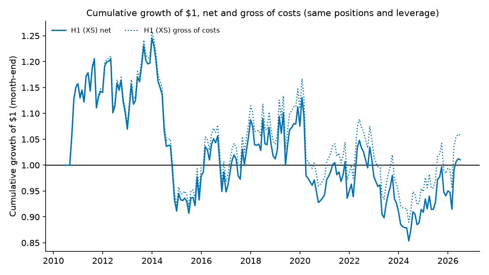
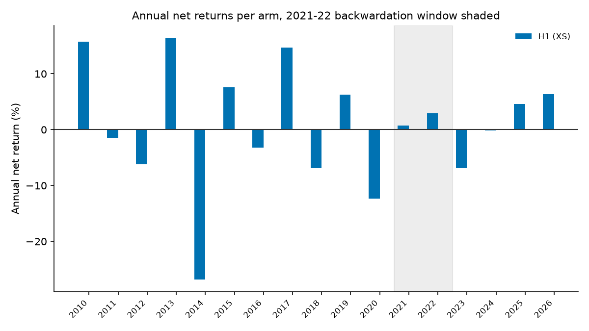

# Commodity Carry Premium — A Falsification Study Across 18 CME Futures

[](https://github.com/AaroNLaU0307/commodity-carry-research/actions/workflows/tests.yml)

**Verdict: no confirmable edge in this sample, net of costs.** A pre-registered, falsification-first
test of the commodity carry premium — cross-sectional (H1) and time-series (H2) — on 18 CME futures
across 4 sectors, 2010–2026. Design (universe, definitions, gates, robustness suite) was frozen and
publicly timestamped before any data entered the repo. 0 of 2 primary arms promoted: H2 closes at the
sign-only premise gate (its premise estimate is negative), and H1 fails four of the five promotion gates.
None of H1's 9 registered variants (all run) reaches the 0.30 Sharpe gate; H2's are not built once it
closes. Diagnostic slices are reported alongside.

> **Re-run (2026-09-28).** The numbers and figures on this page are from the corrected re-run of
> 2026-09-28 (code `70d1e03`): the 2026-09-27 corrections plus the data fixes found while re-running.
> Published → corrected values: [`reports/ADDENDUM_2026-09-27.md`](reports/ADDENDUM_2026-09-27.md) §10. The
> pre-correction reports and figures stay unchanged in `reports/` and `reports/figures/`.

> 18 CME futures / 4 sectors · 2010-06-07 to 2026-06-30 · settlement-based signals · frozen conservative
> cost table · stationary block bootstrap + DSR + BH-FDR · H1 net Sharpe **0.059** (95% CI
> **[−0.41, 0.52]**), H2 closed at the premise gate (TS coefficient **−0.000143**) · 173 tests: 172 on
> synthetic fixtures, 1 on the licensed corpus (skipped without it).

## TL;DR

- **What was tested.** Cross-sectional (H1: rank carry, long top tercile / short bottom tercile) and
  time-series (H2: `sign(carry)` per symbol) commodity carry — 18 CME futures, 4 sectors (energy,
  metals, grains, livestock), 2010-06-07 through 2026-06-30, settlement-price-based signals (never
  last-trade), monthly rebalance, inverse-vol leg weighting and portfolio-level vol targeting inherited
  from a sibling study, and a deliberately conservative frozen cost table (max(1 tick, conservative
  half-spread estimate) + $2.50/side all-in fee allowance) —
  `preregistration/PREREGISTRATION.md` §2–§5.
- **Verdicts table:**

  | Arm | Premise (point est.) | Sharpe | 95% CI | BH-FDR | CI excl. 0 | Sharpe≥0.30 | 2×cost>0 | DSR≥0.95 | Promotion |
  |---|---|---|---|---|---|---|---|---|---|
  | H1 (XS) | +0.028270 (NW(3) t=1.372, p=0.170) | 0.0591 | [−0.4142, 0.5239] | FAIL | FAIL | FAIL | PASS | FAIL | **NOT PROMOTED** |
  | H2 (TS) | −0.000143 (t=−0.069, p=0.945) | — | — | — | — | — | — | — | **CLOSED AT PREMISE** (not promoted) |

  (`reports/rerun/PREMISE_REPORT.md` §"XS premise"/"TS premise"; `reports/rerun/PRIMARY_REPORT.md` §"Summary")


*Figure 1 — H1 net Sharpe (seed 7, the gate-deciding seed) with its 95% bootstrap CI, against the zero line and the 0.30 promotion gate. H2 closed at the premise gate, so it has no backtest to plot. The gray strips hold 16 point estimates from `results/robustness_variants.csv`. Nine are H1's registered variants: items 1–7 and 10 (item 6 is the 2× cost table) and execution one trading day after the signal. Seven are diagnostic slices: F7 ex-PA/PL, sub-period halves and the drop-one-sector jackknife. The per-year and drop-one-year diagnostics are not plotted. Source: `reports/rerun/PRIMARY_REPORT.md` §"Summary", `reports/rerun/ROBUSTNESS_REPORT.md`. The pre-correction figure stays at `reports/figures/gates_forest.png`.*

- **Headline stats with CIs.** H1's 95% bootstrap confidence interval spans zero by a wide margin —
  [−0.41, 0.52] (`reports/rerun/PRIMARY_REPORT.md`) — and its Deflated Sharpe Ratio is 0.3915 against
  the 0.95 gate (N_trials = 16, with H1's own skewness and excess kurtosis and the dispersion of the
  registered Sharpes). H2 closed at the premise gate, so it has no Sharpe, CI or DSR.
- **Public timestamp.** The pre-registration was committed and pushed to a public remote before any
  data entered the repository — `PREREGISTRATION.md` §12 step 1, `PUSH_CHECKLIST.md` — the freeze is
  independently verifiable, not merely asserted in a local commit message.

## The arc, short

**Pre-registration** (universe, locked definitions, cost model, gates, robustness suite, NOT-testing
list — `preregistration/PREREGISTRATION.md`) → **data acquisition** (Databento `GLBX.MDP3`, full
checksummed corpus, `data/MANIFEST.md`) → **three invalidated runs**, each caught by an integrity
anomaly and never a result direction (`reports/PREMISE_REPORT.md` §"Run-history disclosure" has the
full trigger/root-cause/fix table for all three) → the **F11 amendment**, adopted under a legitimacy
test explained in full in [`DESIGN_DECISIONS.md`](DESIGN_DECISIONS.md) → **Run 4**, the
project's first valid computation → **falsification**, evaluated against gates fixed before Run 4 ever
executed.

### What it looked like



*Figure 2 — Cumulative growth of $1 for H1, full sample, linear scale, net (solid) and gross of costs
(dotted), with the same positions and leverage path. Gross Sharpe is 0.0860 against net 0.0591: costs
are a small part of the result, which is why the mechanism table's cost-drag row
(`docs/MECHANISM_NOTES.md` row 2) is marked contradicted. H2 closed at the premise gate and has no series.
Source: `reports/rerun/PRIMARY_REPORT.md`, `reports/rerun/ROBUSTNESS_REPORT.md` §"(a) Gross-of-cost Sharpe".*

## Mechanism: why no edge, when the literature finds one

Five candidate mechanisms, each checked against evidence already sitting in the committed reports —
sample-period decay, cost drag, universe width, curve point, and construction choice — plus a
long-leg-vs-short-leg attribution for H1: the long leg's gains (+1.96%/yr) outweigh the short leg's losses
(−1.31%/yr), each net of its own costs (`reports/rerun/ROBUSTNESS_REPORT.md` §(b); exploratory, no CI).
Full table, citations, and verdicts: **[`docs/MECHANISM_NOTES.md`](docs/MECHANISM_NOTES.md).**

Short version: on the corrected series, cost drag and construction choice are directly **contradicted**
by the gross-of-cost and quintile/equal-weight restatements (gross 0.0860 against net 0.0591; quintiles
0.0584 and equal-weight legs 0.0520); the curve-point question is **weakly, narrowly suggestive** for H1
alone (the 12-month-deferred variant, 0.1750, `reports/rerun/ROBUSTNESS_REPORT.md` item 5); sample-period
decay and universe width remain **genuinely open** — this corpus cannot settle them either way.



*Figure 3 — H1's annual net returns, 2021–22 backwardation window shaded (row 1's sample-period-decay
check): +0.70% in 2021 and +2.97% in 2022, against best years of +16.47% (2013), +15.71% (2010) and
+14.71% (2017). H2 closed at the premise gate and has no series. Full-size version and discussion:
`docs/MECHANISM_NOTES.md` row 1. Source: `reports/rerun/ROBUSTNESS_REPORT.md` §"(c) Per-year table".*

## War stories: four exchange-data identity traps, plus the price of look-ahead safety

Full detail, evidence, and fixes in [`docs/DATA_QA_REPORT.md`](docs/DATA_QA_REPORT.md)'s findings
register. Compact version:

- **F1 — spreads hiding in the parent symbology.** Of 4,505,270 raw `ohlcv-1d` rows returned under
  parent symbology, only 20.91% were genuine single-month outrights — the rest were calendar spreads
  and multi-leg combos sharing the same symbol namespace. A naive string filter misses one of the two
  observed combo formats entirely; the fix uses the `definition` schema's own `instrument_class` field.
- **F6 — `instrument_id` is not a stable key.** ~20% of outright `instrument_id`s (668 of 3,353) were
  reused for a *different* real contract at another point in this dataset's 16-year history — including
  one case spanning two different commodities entirely. Any join must be date-aware; never join on
  `instrument_id` alone across dates.
- **F9 — a single contract's own symbol string can drift mid-life.** One real CL contract
  (`instrument_id` 551735) reported as `"CLM19"` for its first 2 listed days and `"CLM9"` for the
  remaining ~9 years — the same contract, not a collision. Caught via an implausible ~49% held-front
  missing-settlement rate before it was understood.
- **F10 — an expiration *timestamp* can be corrected mid-life → F11, a structural roll deadlock.** One
  KE contract's recorded expiration time-of-day changed mid-life (same calendar date). Keying on the
  full timestamp fractured its OI history and froze the roll rule permanently. Fixing the identity key
  exposed a *deeper*, non-bug problem — the registered single-candidate roll rule deadlocks whenever the
  next-listed contract is a real but illiquid ("dead serial") month, affecting 11 of 18 symbols. Resolved
  by a pre-registered amendment (A1/A2, `DEVIATIONS.md` 2026-07-15), validated read-only before adoption.
- **F12 — the one-day tax of never looking ahead.** Because open interest is only known T+1, the roll
  rule always trails the real market's shift by exactly one day. When that shift is abrupt, the just-
  abandoned contract can go completely dark — in *both* `statistics` and `ohlcv-1d` — on the very first
  day it's no longer front. Found 8 times, all on CL, against CL's own ~193 rolls (~4%) — the cost of the
  look-ahead-safe design, not a defect (`docs/DATA_QA_REPORT.md` finding F12).

The F10/F11 deadlock, made visible for one of the 11 affected symbols:


*Figure 4 — PL under the pre-amendment single-candidate roll rule: the held front's own expiration date
(solid) never advances past 2010-08-27, while the calendar (dashed reference) runs to the end of the
sample. Source: `docs/DATA_QA_REPORT.md` finding F11 (census artifact
`_carry-research-workspace/stuck_episodes_full.csv`, not committed, reproducible via
`scripts/generate_readme_figures.py`).*

## Limitations

- **The sample is entirely post-publication / post-financialization (2010–2026).** Every well-known
  early carry papers' sample predates this window; if the premium's strongest years were earlier and it
  has since been arbitraged down or crowded out, this sample cannot see that — see
  `docs/MECHANISM_NOTES.md` row 1.
- **18 CME markets — ICE-listed softs excluded, pre-declared.** Sugar, coffee, cocoa, and cotton were
  excluded before any computation because ICE's history via Databento begins only 2018-12-23 (~7.6
  years), failing this study's 10-year minimum (`docs/DATA_FEASIBILITY_REPORT.md` line 35;
  `docs/DECISION_MEMO.md`: "softs excluded as a pre-declared scope limitation"). LME base metals were
  never in scope. A wider universe (the literature commonly runs 24–35 markets) was not tested — see
  `docs/MECHANISM_NOTES.md` row 3.
- **Front-slope carry definition; the 12-month curve point was tested only as a robustness variant, not
  primary.** `PREREGISTRATION.md` §3 locks the carry definition to front-vs-next; a further-out curve
  point was pre-registered as §8 item 5 specifically so it could be checked without becoming a second
  primary hypothesis — see `docs/MECHANISM_NOTES.md` row 4 for what it showed.
- **Power statement.** From H1's bootstrap standard error (≈ half the 95% CI width ÷ 1.96: SE ≈ 0.239)
  and the standard two-sided-5%/80%-power minimum detectable effect (SE × 2.8 ≈ 0.67; both in
  `results/dsr_thresholds.json`, computed from `results/primary_summary.json`), **this design could
  reliably confirm a true annualized net Sharpe of roughly 0.67 or larger — not the 0.30 the gate itself
  required.** Put plainly: even a strategy sitting exactly at this study's own promotion threshold would
  have had well under even odds of producing a significant result at this sample size. The DSR gate sits
  between the two: under the re-run's inputs (n = 4,069 daily observations, H1's skewness and excess
  kurtosis, the dispersion of the registered Sharpes), DSR ≥ 0.95 requires an annualized net Sharpe of
  about **0.54** at N_trials = 16 (0.53 at N_trials = 14; `results/dsr_thresholds.json`). H2 closed at the
  premise gate and has no power statement. This is a limitation stated with numbers, not an apology — the
  design was powered to catch a large edge, and a large edge is not what commodity carry, on this
  construction, in this sample, turned out to be.

## Read this repo in 5 minutes

1. [`preregistration/PREREGISTRATION.md`](preregistration/PREREGISTRATION.md) (+ its Amendments log at
   the end) — the frozen design, and the two post-freeze amendments (A1, A2).
2. [`reports/rerun/PREMISE_REPORT.md`](reports/rerun/PREMISE_REPORT.md) — the cheap sign-only gate
   (H2 closes there), and the full run-history disclosure (three invalidated runs, why each was
   invalidated, why none was result-motivated).
3. [`reports/rerun/PRIMARY_REPORT.md`](reports/rerun/PRIMARY_REPORT.md) — the five promotion gates,
   evaluated for H1.
4. [`reports/rerun/ROBUSTNESS_REPORT.md`](reports/rerun/ROBUSTNESS_REPORT.md) — H1's 9 registered variants
   (all run) plus diagnostic slices, none gating, all reported. The published pre-correction versions of
   these three reports stay in `reports/`.
5. [`DEVIATIONS.md`](DEVIATIONS.md) — the logged departures from the frozen design, dated, with authority
   and rationale for each. **Correction (2026-09-27):** an earlier version of this line said every
   departure was logged before the deviating computation ran. That is not so. The next-settlement ≤ 0
   entry (2026-07-11) records that it was discovered on the first real-data run. The item-7 day-count
   entry (2026-07-16) was committed together with the robustness results, so git cannot show it came
   first. The specification choices behind robustness items 1, 4 and 5 were never logged; they are
   recorded retroactively in `reports/ADDENDUM_2026-09-27.md` §6-7.
6. [`reports/ADDENDUM_2026-09-27.md`](reports/ADDENDUM_2026-09-27.md) and
   [`preregistration/AMENDMENT_2026-09-27.md`](preregistration/AMENDMENT_2026-09-27.md) — the
   2026-09-27 corrections and the execution-timing amendment; [`RERUN_RUNBOOK.md`](RERUN_RUNBOOK.md)
   — how to re-run on the corpus.

## Related research

Part of a falsification-first research series across asset classes and strategy families:

- [`multi-asset-tsmom-research`](https://github.com/AaroNLaU0307/multi-asset-tsmom-research) - time-series momentum across asset classes, **supported, not independently confirmed** (net Sharpe 0.75 at 2 bps, 95% bootstrap CI [0.29, 1.23] excludes zero); XSMOM falsified and four overlay studies not promoted.
- [`quant-backtest-framework`](https://github.com/AaroNLaU0307/quant-backtest-framework) - multi-instrument SMC price-action study, **falsified** (0/210 cross-instrument BH-FDR across 5 instruments x 42 configs; these figures predate the fix of two look-ahead paths in its engine, re-run pending).
- [`orderflow-research-engine`](https://github.com/AaroNLaU0307/orderflow-research-engine) - order-flow footprint signals on BTC/ETH perps, **null** (0/20 cells survive BH-FDR; H3 and H6 underpowered under the pre-registered event-count gate; no OOS return statistic computed or reported).
- [`spot-mfi-btc-perp-research`](https://github.com/AaroNLaU0307/spot-mfi-btc-perp-research) - spot money-flow signals for BTC perps, base study **falsified** (0/42 BH-FDR); funding-divergence follow-up **inconclusive, leaning falsified**.

The series' base rate is the point: most hypotheses fail, and the failures are reported as fully as the
one supported result.

## Repository layout

- `docs/` — Phase 0/1 snapshots (data feasibility, decision memo, sample audit, data QA report and
  findings register) and the mechanism notes; `DESIGN_DECISIONS.md` (repository root) answers the
  obvious objections.
- `preregistration/` — the frozen pre-registration, its post-freeze amendments log, and the dated
  execution-timing amendment (`AMENDMENT_2026-09-27.md`). Deviations are logged in
  [`DEVIATIONS.md`](DEVIATIONS.md); three robustness specifications that never were are recorded in
  `reports/ADDENDUM_2026-09-27.md`.
- `data/` — provenance conventions and the manifest (checksums, request parameters). Raw data is never
  committed here — see `data/README.md`.
- `src/` — the computation engine (data loading, roll rule, carry, returns, costs, vol targeting,
  portfolio construction, statistics, robustness constructions), one module per
  `PREREGISTRATION.md` section, cited in each module's docstring.
- `tests/` — unit tests for every `src/` module, exclusively on synthetic fixtures (no real data in the
  test suite, by design).
- `scripts/` — the corpus pull and QA scripts, the Phase 1b/1c runners, and the single entry point
  `run_all.py` (`check-data`, then premise → primary → robustness → figures). The runners need the
  licensed corpus; `tests/test_run_all.py` drives them end to end on a synthetic corpus.
- `reports/` — runner-generated, immutable once committed (`PREMISE_REPORT.md`, `PRIMARY_REPORT.md`,
  `ROBUSTNESS_REPORT.md`, `figures/`). Corrections happen via dated addenda
  (`ADDENDUM_2026-09-27.md`), never silent edits. The corrected pipeline writes its reports and figures
  to `reports/rerun/`.
- `results/` — `headline.json`, the headline rows with the artifact and line behind each number; the
  runners write their machine-readable results here (`premise_summary.json`, `primary_summary.json`,
  `primary_monthly_returns.csv`, `robustness_variants.csv`), committed with the re-run.

## Data storage

Raw pulled data is licensed and never committed. `src/config.py`'s `DATA_DIR` defaults to `data/raw/`
inside the checkout (git-ignored); set the `DATA_DIR` environment variable to wherever the corpus lives.
`WORKSPACE` (default `data/workspace/`, also git-ignored) holds uncommitted intermediate files. The repo
itself only ever holds a provenance manifest (`data/MANIFEST.md`: request parameters, timestamps,
SHA-256 checksums) and the reports and results above — never the raw files themselves.

## Reproduce

Python 3.13 (the version CI runs; `requirements.txt` pins every dependency):

```
python -m venv .venv && . .venv/bin/activate
pip install -r requirements.txt
pytest                                                          # 173 tests; 1 needs the licensed corpus
DATA_DIR=/path/to/commodity-carry python scripts/run_all.py check-data
DATA_DIR=/path/to/commodity-carry python scripts/run_all.py     # writes reports/rerun/ and results/
```

The two data commands need the licensed Databento corpus. [`RERUN_RUNBOOK.md`](RERUN_RUNBOOK.md) is the
step-by-step for the re-run: what `check-data` must show before anything runs, and which report,
result and README numbers each stage produces.
